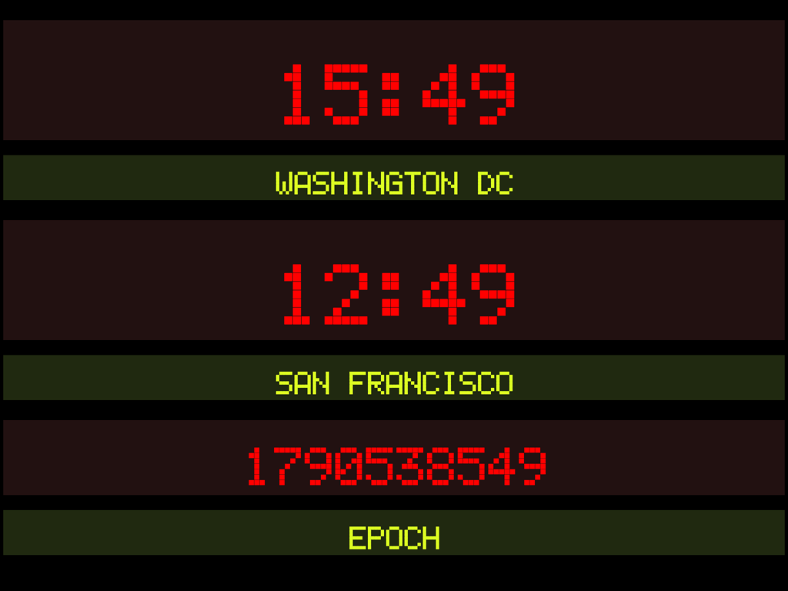

# Situation Clock

*LED-style situation room clock formatted for iPads*. **[Live example](https://ben.balter.com/situation-clock/)**



Forked from [schacon/situation-clock](https://github.com/schacon/situation-clock), which states:

> If you want to build a Situation Room, you'll need some sweet red clocks in the walls... something like this:
>
> 

## Features

* That red/green, LED-style text you'd expect
* Displays current time and location name
* It's a webpage, so it works in your tablet's browser
* Hosted on GitHub Pages
* [EPOCH/unix time format](http://en.wikipedia.org/wiki/Unix_time) support
* Full, native timezone support
* Ability to have multiple clocks per iPad
* Clock(s) dynamically resize to fill screen
* App-ified so it can be saved to the iOS home screen
* Displays GitHub status incidents (or any Statuspage.io page)
* Keeps the screen awake while open (where the Screen Wake Lock API is supported)

## Usage

1. Get an iPad, and fire up Safari
2. Visit [ben.balter.com/situation-clock](https://ben.balter.com/situation-clock) in Safari, or fork this repository and open the GitHub Pages published version of your fork
3. Click the share button
4. Click add to home screen
5. Give your situation clock a name
6. Open the newly created shortcut
7. (optional) use Velcro or similar to mount to the wall

*Note: You can also pass a URL parameter of `location`, e.g., `?location=ZULU`, to add an extra clock via the URL. It uses the system timezone.*

## Adding/modifying a clock

Clocks are stored in the YAML front matter of `index.html`. To add/modify a clock, follow the format below:

```yaml
---
clocks:
  - name: "Washington DC"
    timezone: America/New_York
  - name: "San Francisco"
    timezone: America/Los_Angeles
  - name: "EPOCH"
    timezone: EPOCH
statuspage: kctbh9vrtdwd
---
```

* `timezone` is any [IANA timezone name](https://en.wikipedia.org/wiki/List_of_tz_database_time_zones), or `EPOCH` for Unix time. An unrecognized timezone displays `ERR` for that clock.
* `statuspage` is the [Statuspage.io](https://www.atlassian.com/software/statuspage) page ID whose incidents are shown as a banner. The default is GitHub's. Remove the key to disable the banner.

## Developing

Requires Node.js (see `.nvmrc`). The site is built with [Eleventy](https://www.11ty.dev/); `src/script.ts` is bundled by [Vite](https://vite.dev/) into `assets/script.js`.

1. Establish your development environment by running `script/bootstrap`
2. Spin up a local version by running `script/server` (rebuilds and reloads on change)
3. Visit [localhost:8080](http://localhost:8080) in your favorite browser

Other useful commands:

* `npm test`: type-check
* `npm run lint`: lint
* `npm run build`: build the site into `_site/`

## Contributing

1. Fork the project
2. Create a new, descriptively named feature branch
3. Make your changes
4. Submit a pull request
